# Incident Tracker

A small incident tracker and the platform around it. Open an incident with a
severity (SEV1 to SEV4) and the service it hits, move it through `open`,
`investigating` and `resolved`, and keep a timeline of notes. Around the app:
Docker images, a Helm chart, a GitHub Actions pipeline with security scanning
and a security gate, Prometheus and Grafana, GitOps with Argo CD, and Terraform
for the AWS version (VPC, EKS, ECR, S3).

Everything below was run for real: Docker Desktop on a Mac, a single node kind
cluster called `incidents` (Kubernetes v1.37.0), GitHub Actions on this
repository, and a real AWS account in `ap-south-1` that was applied, checked
and destroyed in one sitting. The AWS account ID is shown as `<account-id>`.

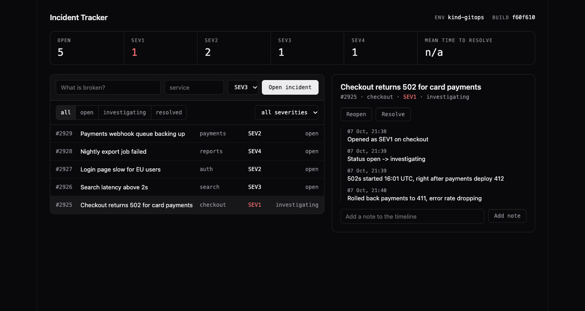

## Overview

| Path | What it is |
|---|---|
| `backend/` | FastAPI, SQLAlchemy, Alembic migration, 15 pytest tests, Dockerfile |
| `frontend/` | React and Vite, multi-stage Dockerfile, served by unprivileged nginx |
| `docker-compose.yml` | Frontend, backend and Postgres in one command |
| `k8s/` | Namespace, kind cluster config, and the files for the failure drills |
| `helm/incidents/` | Deployments, StatefulSet, Services, ConfigMap, Secret, Ingress, HPA, ServiceMonitor, Grafana dashboard, `helm test` |
| `terraform/` | VPC, subnets, NAT, security group, IAM, EKS, ECR, S3 |
| `.github/workflows/ci.yml` | Test, scan, build, gate, push, deploy |
| `security/` | gitleaks, Bandit and Trivy config and `gate.sh` |
| `monitoring/` | kube-prometheus-stack values and `load-test.sh` |
| `gitops/` | Argo CD `Application`, Argo CD values, the `incidents-kind` environment chart |

API:

| Method | Path | What it does |
|---|---|---|
| GET | `/health`, `/ready` | Liveness, and readiness with a database check |
| GET | `/metrics` | Prometheus metrics |
| GET | `/api/info` | Title, environment and build version from the ConfigMap |
| GET, POST | `/api/incidents` | List (filters `status`, `severity`, `service`) and create |
| GET, PUT, DELETE | `/api/incidents/{id}` | One incident with its timeline, edit, delete |
| POST | `/api/incidents/{id}/status` | Change status, sets or clears `resolved_at`, adds a timeline entry |
| GET, POST | `/api/incidents/{id}/notes` | Read and add timeline notes |
| GET | `/api/stats` | Open count by severity and mean time to resolve |

Metrics: `incidents_created_total{severity}`, `incidents_resolved_total`, the
`incidents_open` gauge, the `incidents_time_to_resolve_seconds` histogram, and
the request metrics from prometheus-fastapi-instrumentator.

## Architecture diagram

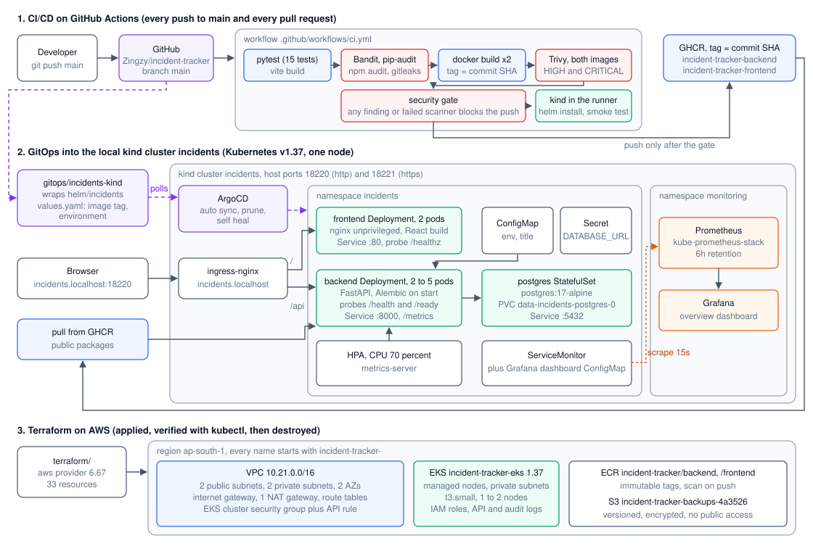

CI tests, scans and builds every push and pull request, and pushes images
tagged with the commit SHA to GHCR only after the security gate passes. Argo CD
in the kind cluster deploys whatever SHA `gitops/incidents-kind/values.yaml`
names. Terraform builds the AWS version of the platform.

## Technologies

Python 3.12, FastAPI, SQLAlchemy, Alembic, PostgreSQL 17, React 19, Vite 8,
pytest, Docker and Compose, kind, ingress-nginx, metrics-server, Helm 4, GitHub
Actions, GHCR, Bandit, pip-audit, npm audit, gitleaks, Trivy,
kube-prometheus-stack, Argo CD, Terraform with the AWS provider, AWS CLI.

## Setup

```bash
cd backend
pip install -r requirements-dev.txt
pytest -v
```

```
tests/test_api.py::test_health PASSED                                    [  6%]
tests/test_api.py::test_ready_checks_the_database PASSED                 [ 13%]
...
tests/test_api.py::test_status_change_sets_and_clears_resolved_at PASSED [ 86%]
tests/test_api.py::test_stats PASSED                                     [ 93%]
tests/test_api.py::test_metrics_expose_incident_counters PASSED          [100%]

============================== 15 passed in 0.37s ==============================
```

The tests cover every endpoint, the filters, the timeline, resolving and
reopening, the stats, the metrics, and the error paths (422 for an unknown
severity or status, 404 for a missing incident). `conftest.py` swaps the
database for in-memory SQLite, so tests never need PostgreSQL.

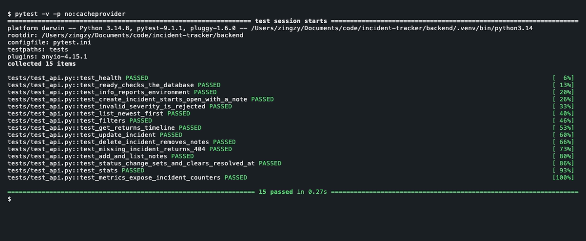

Tables come from Alembic (`0001_create_incidents.py`). Every backend replica
runs `alembic upgrade head` on start, so `alembic/env.py` takes a PostgreSQL
advisory lock first. On the first install, of two replicas starting together,
only one logged `Running upgrade  -> 0001_create_incidents`. The other waited
for the lock and found nothing to do.

## Docker

```bash
docker compose up --build -d
```

The app is at http://localhost:3000.

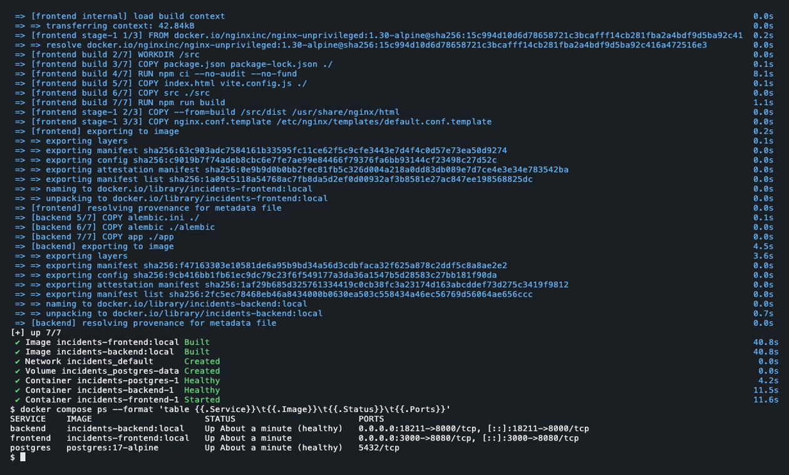

The backend image is `python:3.12-alpine` with pip removed, running as uid
10001. The frontend builds in a Node stage and ships only `dist/` in
`nginxinc/nginx-unprivileged:1.30-alpine`, running as uid 101. The nginx config
is a template, so `BACKEND_HOST` decides where `/api` goes: `backend` in
Compose, the Service name in Kubernetes. Compose starts the frontend only once
the backend's `/ready` healthcheck passes.

A walkthrough through the frontend's proxy:

```bash
curl -s -X POST localhost:3000/api/incidents -H 'Content-Type: application/json' -d '{"title":"Checkout returns 502","service":"checkout","severity":"SEV1"}'
curl -s -X POST localhost:3000/api/incidents -H 'Content-Type: application/json' -d '{"title":"Search latency above 2s","service":"search","severity":"SEV3"}'
curl -s -X POST localhost:3000/api/incidents/1/notes -H 'Content-Type: application/json' -d '{"body":"Rolled back payments deploy"}'
curl -s -X POST localhost:3000/api/incidents/1/status -H 'Content-Type: application/json' -d '{"status":"resolved"}' | jq -c '{status, resolved_at, notes: [.notes[].body]}'
curl -s -X PUT localhost:3000/api/incidents/2 -H 'Content-Type: application/json' -d '{"severity":"SEV2"}' | jq -c '{id, severity}'
curl -s localhost:3000/api/stats
```

```
{"id":1,"title":"Checkout returns 502","service":"checkout","severity":"SEV1","status":"open","created_at":"2026-10-07T15:33:15.903768Z","resolved_at":null,"notes":[{"id":1,"body":"Opened as SEV1 on checkout","created_at":"2026-10-07T15:33:15.913348Z"}]}
...
{"id":3,"body":"Rolled back payments deploy","created_at":"2026-10-07T15:33:16.807151Z"}
{"status":"resolved","resolved_at":"2026-10-07T15:33:16.975577Z","notes":["Opened as SEV1 on checkout","Rolled back payments deploy","Status open -> resolved"]}
{"id":2,"severity":"SEV2"}
{"open":1,"open_by_severity":{"SEV1":0,"SEV2":1,"SEV3":0,"SEV4":0},"resolved":1,"mean_time_to_resolve_seconds":1.071809}
```

Every status change writes its own timeline entry, so an incident's history is
complete without anyone typing it.

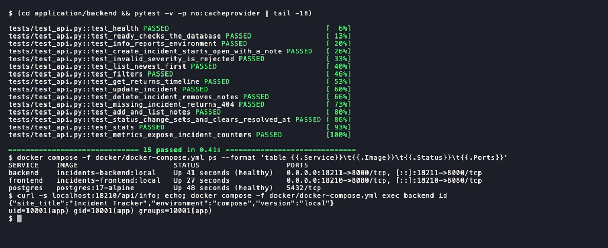

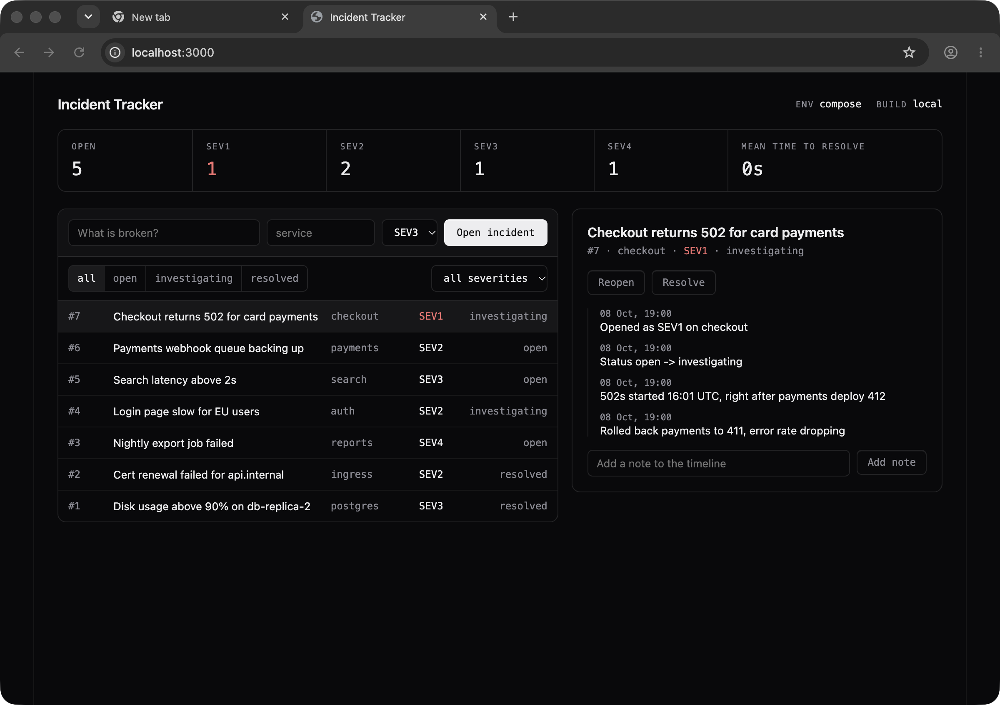

## Kubernetes

```bash
kind create cluster --config k8s/kind-config.yaml
kubectl apply -f https://raw.githubusercontent.com/kubernetes/ingress-nginx/controller-v1.15.1/deploy/static/provider/kind/deploy.yaml
kubectl apply -f https://github.com/kubernetes-sigs/metrics-server/releases/latest/download/components.yaml
kubectl apply -f k8s/namespace.yaml
kubectl -n incidents get deploy,sts,svc,ingress,hpa,pvc
```

```
NAME                                 READY   UP-TO-DATE   AVAILABLE   AGE
deployment.apps/incidents-backend    5/5     5            5           13m
deployment.apps/incidents-frontend   2/2     2            2           13m
...
ingress.networking.k8s.io/incidents   nginx   incidents.localhost   localhost   80      13m
...
horizontalpodautoscaler.autoscaling/incidents-backend   Deployment/incidents-backend   cpu: 27%/70%   2         5         5          13m
...
persistentvolumeclaim/data-incidents-postgres-0   Bound    pvc-ebaafae4-1224-431a-a02e-d11783073d03   1Gi        RWO            standard       <unset>                 13m
```

| Piece | How |
|---|---|
| ConfigMap, Secret | `incidents-config` (environment, title, version), `incidents-db` (`DATABASE_URL` through `secretKeyRef`) |
| Ingress | `incidents.localhost`: `/api` to the backend, `/` to the frontend. `*.localhost` resolves to 127.0.0.1 without editing `/etc/hosts` |
| HPA | Backend 2 to 5 at 70 percent CPU. The Deployment leaves `replicas` out so Helm and Argo CD do not fight the HPA |
| Probes | Backend startup and liveness on `/health`, readiness on `/ready`. Frontend `/healthz`. PostgreSQL `pg_isready`. An init container waits for PostgreSQL |
| Storage | PostgreSQL StatefulSet with PVC `data-incidents-postgres-0` |

On kind, metrics-server also needs `--kubelet-insecure-tls`, because the
kubelet certificate has no IP SANs. Without it the HPA shows `<unknown>`.

Three copies of `monitoring/load-test.sh` (open, add a note, filter, resolve,
in a loop) scaled the backend out:

```
21:10:45
incidents-backend   Deployment/incidents-backend   cpu: 443%/70%   2     5     2     6m21s
21:11:05
incidents-backend   Deployment/incidents-backend   cpu: 559%/70%   2     5     4     6m41s
21:11:25
incidents-backend   Deployment/incidents-backend   cpu: 559%/70%   2     5     5     7m1s
```

## Helm

The chart refuses to render without an image tag (`backend.tag is required, use
the commit SHA that CI pushed`), and hashes the ConfigMap and Secret into pod
annotations so a config change rolls the pods.

```bash
helm upgrade --install incidents helm/incidents -n incidents --set backend.tag=local,frontend.tag=local --wait
helm test incidents -n incidents --logs
```

```
...
{"status":"READY"}
{"site_title":"Incident Tracker","environment":"kind","version":"local"}
<title>Incident Tracker</title>
```

The test pod checks the backend's `/ready` and goes through the frontend
Service to `/api/info`, which also proves the frontend can reach the backend.

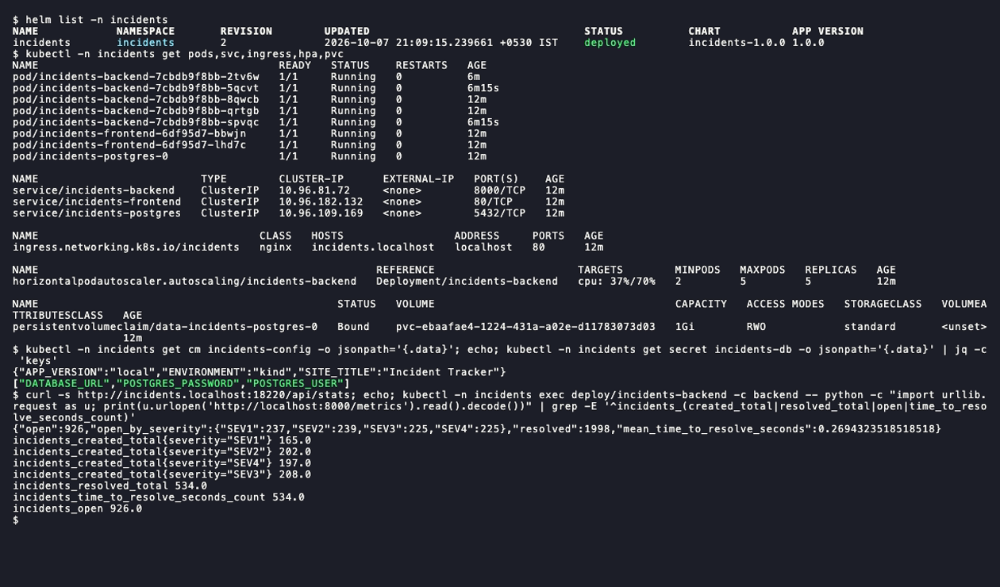

## Terraform

Terraform describes what the app needs on AWS, in `ap-south-1`. The account
also runs other things, so the code stays in its lane: the region is pinned,
every name starts with `incident-tracker-`, the provider's `default_tags` put
`Project=incident-tracker` and `ManagedBy=terraform` on everything, the EKS
public endpoint only accepts one IP (`TF_VAR_admin_cidr`), and the ECR
repositories and S3 bucket can be deleted even when not empty. EKS creates its
log group by itself if missing, and then `terraform destroy` leaves it behind,
so Terraform creates `/aws/eks/incident-tracker-eks/cluster` first.

It builds a VPC `10.21.0.0/16` with two public and two private subnets in two
AZs, an internet gateway, one NAT gateway, route tables, a security group for
the API, two IAM roles, EKS 1.37 with one `t3.small` node (1 to 2) in the
private subnets, two ECR repositories, and a versioned, encrypted S3 bucket. A
`t3.micro` only fits 4 pods with the VPC CNI, and the system pods use them up.
One NAT gateway instead of one per AZ keeps the cost down, at the price of
private egress if that AZ fails.

```bash
cd terraform
NETRC=/dev/null terraform init
terraform plan -out=incident-tracker.tfplan
terraform apply incident-tracker.tfplan
```

```
Plan: 33 to add, 0 to change, 0 to destroy.
...
aws_nat_gateway.main: Creation complete after 1m24s [id=nat-006a1c09b6cf9baf4]
aws_eks_cluster.main: Creation complete after 8m14s [id=incident-tracker-eks]
aws_eks_node_group.main: Creation complete after 1m52s [id=incident-tracker-eks:incident-tracker-default]
Apply complete! Resources: 33 added, 0 changed, 0 destroyed.
```

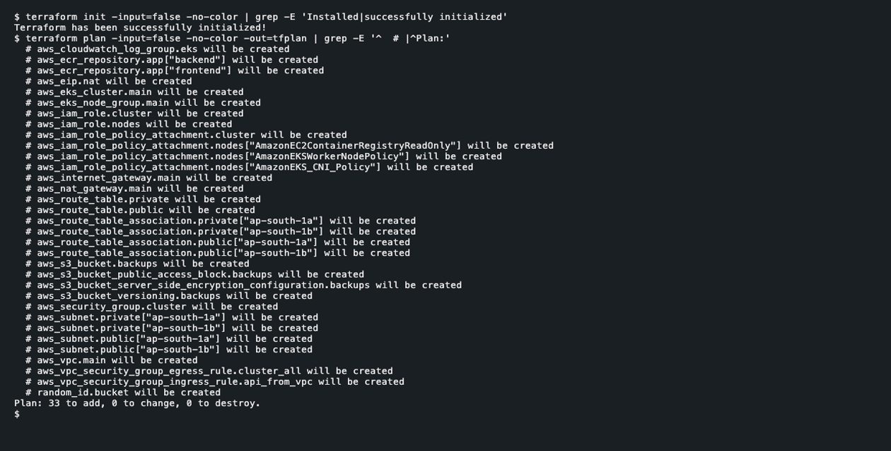

The apply ran from 21:35:04 to 21:45:34, mostly the EKS control plane.

```bash
aws eks update-kubeconfig --region ap-south-1 --name incident-tracker-eks --kubeconfig ./eks.kubeconfig
kubectl get nodes -o wide
kubectl create deployment incidents-frontend --image=ghcr.io/zingzy/incident-tracker-frontend:f60f610a12d52e55879b917079cf880f83c816fd --port=8080
kubectl set env deployment/incidents-frontend BACKEND_HOST=kubernetes.default.svc.cluster.local
kubectl get pods -o wide
```

```
NAME                                         STATUS   ROLES    AGE    VERSION               INTERNAL-IP   EXTERNAL-IP   OS-IMAGE                        KERNEL-VERSION                            CONTAINER-RUNTIME
ip-10-21-1-143.ap-south-1.compute.internal   Ready    <none>   3m7s   v1.37.0-eks-3b4a6ca   10.21.1.143   <none>        Amazon Linux 2023.12.20260928   6.18.51-120.162.amzn2023.x86_64 (amd64)   containerd://2.2.7+unknown
...
NAME                                  READY   STATUS    RESTARTS   AGE   IP           NODE                                         NOMINATED NODE   READINESS GATES
incidents-frontend-55f8674d75-z7ztb   1/1     Running   0          35s   10.21.1.69   ip-10-21-1-143.ap-south-1.compute.internal   <none>           <none>
```

The node joined, and the frontend image CI pushed to GHCR ran on it with a real
VPC address and served `<title>Incident Tracker</title>` through a
port-forward. kubectl worked without an `aws-auth` ConfigMap because the cluster
uses `API` authentication mode with an admin access entry for whoever created
it.

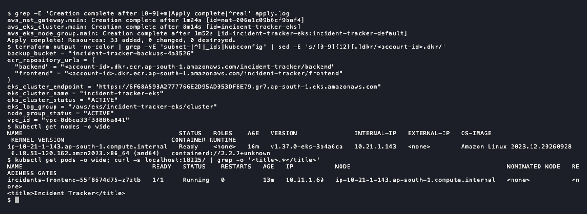

```bash
terraform destroy
```

```
aws_nat_gateway.main: Destruction complete after 50s
aws_eks_node_group.main: Destruction complete after 8m12s
aws_eks_cluster.main: Destruction complete after 2m32s
Destroy complete! Resources: 33 destroyed.
```

Deleting the node group took four times longer than creating it: EKS drains
the node and waits for the Auto Scaling group to terminate it. Afterwards the
tagging API still listed the NAT gateway and two security group rules, so I
asked each service directly:

```
$ aws ec2 describe-nat-gateways --region ap-south-1 --nat-gateway-ids nat-006a1c09b6cf9baf4 --query "NatGateways[].[NatGatewayId,State]"
nat-006a1c09b6cf9baf4	deleted
$ aws ec2 describe-instances --region ap-south-1 --filters Name=tag:eks:cluster-name,Values=incident-tracker-eks --query "Reservations[].Instances[].[InstanceId,State.Name]"
i-0231ffba8e8a34c48	terminated
...
aws: [ERROR]: An error occurred (InvalidVpcID.NotFound) when calling the DescribeVpcs operation: The vpc ID 'vpc-0d6ea33f38886a841' does not exist
...
$ aws ec2 describe-network-interfaces --region ap-south-1 --filters Name=tag:cluster.k8s.amazonaws.com/name,Values=incident-tracker-eks --query "NetworkInterfaces[].NetworkInterfaceId"
...
$ aws eks list-clusters --region ap-south-1 --query "clusters[?starts_with(@, `incident-tracker`)]"
$ aws ecr describe-repositories --region ap-south-1 --query "repositories[?starts_with(repositoryName, `incident-tracker`)].repositoryName"
$ aws logs describe-log-groups --region ap-south-1 --log-group-name-prefix /aws/eks/incident-tracker --query "logGroups[].logGroupName"
$ aws s3api list-buckets --query "Buckets[?starts_with(Name, `incident-tracker-`)].Name"
$ aws iam list-roles --query "Roles[?starts_with(RoleName, `incident-tracker-`)].RoleName"
```

Everything after the terminated instance came back empty, and so did the checks
for Elastic IPs and security groups. The node's instance and its network
interface never carry the `Project` tag, because the Auto Scaling group and the
VPC CNI create them, so those checks filter on the cluster name instead. The
EKS control plane existed for about 40 minutes, the NAT gateway and the node
for about 30, which costs a few US cents.

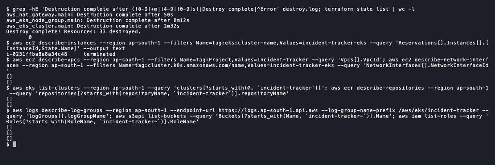

## CI/CD

`.github/workflows/ci.yml` runs on every push to `main`, every pull request,
and by hand:

```
backend tests + frontend build -> Bandit, pip-audit/npm audit, gitleaks -> docker build (SHA tag)
  -> Trivy -> security gate -> push to GHCR -> kind in the runner, helm install, smoke test
```

Both images are built once, saved to a tar and handed between jobs, so the
image pushed is the image Trivy scanned. Before the deploy, the job waits for
the ingress-nginx Deployment and then retries a server-side dry run of a
throwaway Ingress until the admission webhook accepts it, because a Ready
controller pod can still refuse webhook calls for a moment.

Run [37644792039](https://github.com/Zingzy/incident-tracker/actions/runs/37644792039)
on `f60f610` passed all 10 jobs on the first push:

```
pushed ghcr.io/zingzy/incident-tracker-backend@sha256:35f21f0716f9329457ba2a5789237e1e3c7254114ea773917845d7f8bdc7533e
pushed ghcr.io/zingzy/incident-tracker-frontend@sha256:1130d0635dd4e3af9056f1076a26756fb0a1474898b6aa3470c5a4e8b922aea8
{"site_title":"Incident Tracker","environment":"ci","version":"f60f610a12d52e55879b917079cf880f83c816fd"}
true
true
{"open":0,"open_by_severity":{"SEV1":0,"SEV2":0,"SEV3":0,"SEV4":0},"resolved":1,"mean_time_to_resolve_seconds":0.025653}
<title>Incident Tracker</title>
```

The smoke test requires `/api/info` to report exactly the commit SHA, then
opens an incident, adds a note and resolves it, and uses `jq -e` to check that
`resolved_at` is set and the timeline has three entries (the two `true` lines).

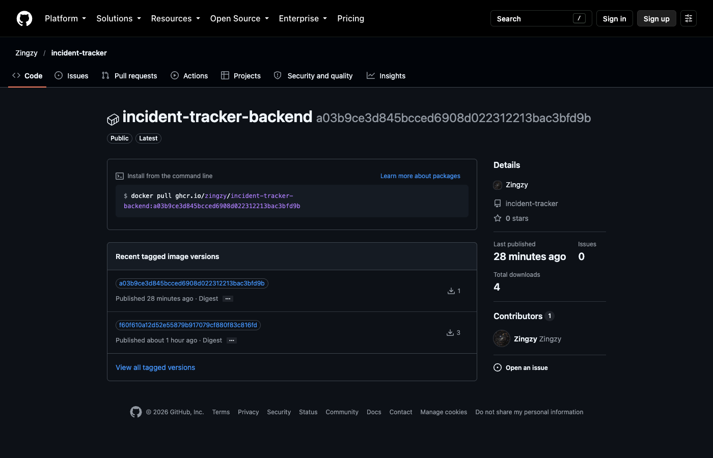

## DevSecOps

| Check | Tool | Blocks on |
|---|---|---|
| SAST | Bandit | any HIGH finding |
| SCA | pip-audit, npm audit | any Python advisory, any npm high or critical |
| Secrets | gitleaks on the tree and the full history | any finding |
| Images | Trivy on both images | any HIGH or CRITICAL CVE, any secret |
| Gate | `security/gate.sh` | any count above zero, or a scanner job that did not succeed |

Scanners only report counts, and the gate decides. It fails closed: a skipped
or crashed scanner is a block, not a pass.

```
| Check | Findings | Verdict |
|---|---|---|
| SAST, Bandit HIGH | 0 | pass |
| SCA, pip-audit + npm audit | 0 | pass |
| Secrets, gitleaks | 0 | pass |
| Images, Trivy HIGH/CRITICAL | 0 | pass |
| Images, Trivy secrets | 0 | pass |
Security gate passed.
```

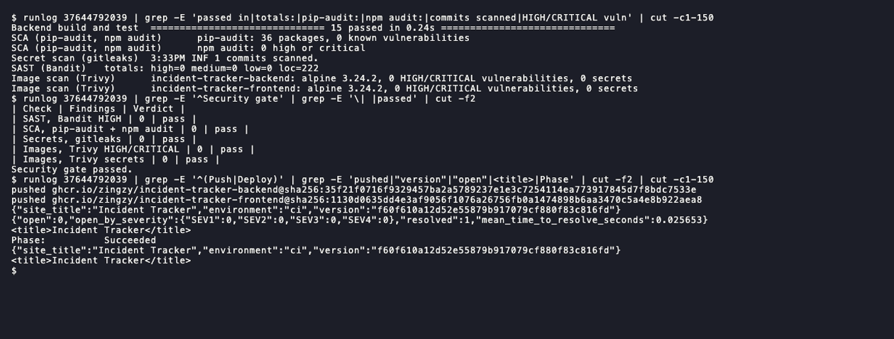

Trivy scanned the Alpine 3.24.2 OS packages and the Python packages in both
images and found nothing HIGH or CRITICAL. That comes from current pinned
dependencies, Alpine bases and no pip in the runtime image. A clean scan is only
true on the day it ran, which is why it runs on every push. The gitleaks config
allowlists one pattern: the public CPython release key fingerprint that Python
base images set in `GPG_KEY`.

## Monitoring

`monitoring/kube-prometheus-stack-values.yaml` trims the stack for a small
laptop: no control plane targets kind cannot expose, one Alertmanager, 6 hours
of retention, small limits. The chart's ServiceMonitor scrapes the backend's
`/metrics`, and its dashboard ships as a ConfigMap that Grafana's sidecar loads.

```bash
helm upgrade --install kps oci://ghcr.io/prometheus-community/charts/kube-prometheus-stack --version 92.0.0 \
  -n monitoring --create-namespace -f monitoring/kube-prometheus-stack-values.yaml --wait
helm upgrade incidents helm/incidents -n incidents --reuse-values \
  --set monitoring.serviceMonitor.enabled=true --set monitoring.grafanaDashboard.enabled=true
curl -s 'localhost:18222/api/v1/targets?state=active' | jq -r '.data.activeTargets[] | "\(.labels.job)\t\(.labels.namespace)\t\(.scrapeUrl)\t\(.health)"' | sort | grep incidents
```

```
incidents-backend	incidents	http://10.244.0.12:8000/metrics	up
incidents-backend	incidents	http://10.244.0.13:8000/metrics	up
incidents-backend	incidents	http://10.244.0.24:8000/metrics	up
incidents-backend	incidents	http://10.244.0.25:8000/metrics	up
incidents-backend	incidents	http://10.244.0.26:8000/metrics	up
```

All five backend pods were scraped while the HPA had them scaled out. The
`incidents_open` gauge reads the database at scrape time, so every replica
reports the same number and the dashboard uses `max()`, not `sum()`.

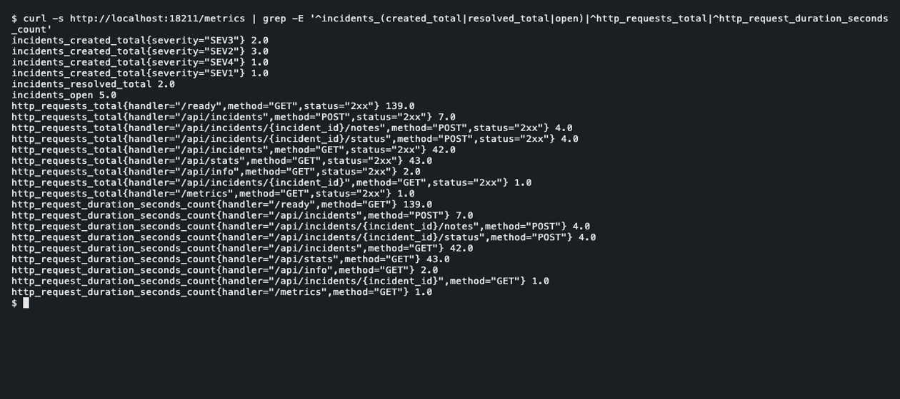

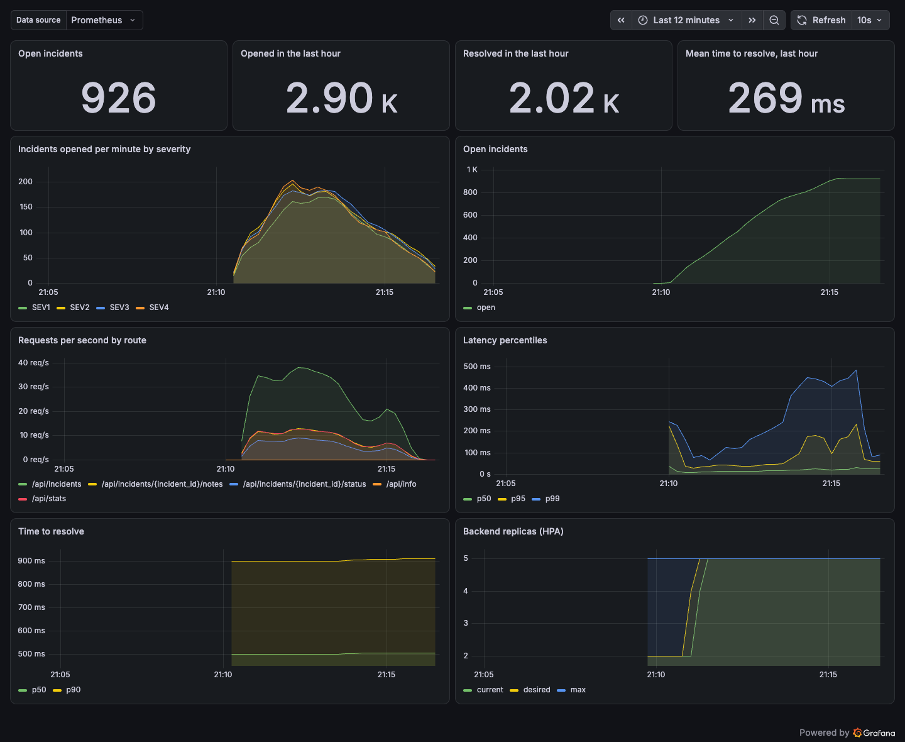

Logs come from `kubectl logs`. The ingress-nginx access log also records which
backend pod answered each request.

## GitOps

Argo CD watches this repository's `main` branch at `gitops/incidents-kind`, a
small chart whose only dependency is `file://../../helm/incidents`, plus the
`values.yaml` for the kind cluster. Sync is automated with prune and self heal.

```bash
helm pull argo-cd --repo https://argoproj.github.io/argo-helm --version 10.9.6
helm upgrade --install argocd ./argo-cd-10.9.6.tgz -n argocd --create-namespace -f gitops/argocd-values.yaml --wait
kubectl apply -f gitops/application.yaml
```

The promotion: commit `a03b9ce` (21:33:58) changed only the image tags in
`values.yaml` from `local` to `f60f610...`, the SHA CI had built, scanned and
pushed. No kubectl. Every 10 seconds:

```
21:35:21 argo=f60f610 Synced/Healthy api={"site_title":"Incident Tracker","environment":"kind-gitops","version":"local"}
21:35:31 argo=a03b9ce Synced/Progressing api={"site_title":"Incident Tracker","environment":"kind-gitops","version":"local"}
...
21:36:13 argo=a03b9ce Synced/Progressing api={"site_title":"Incident Tracker","environment":"kind-gitops","version":"f60f610a12d52e55879b917079cf880f83c816fd"}
21:36:24 argo=a03b9ce Synced/Progressing api={"site_title":"Incident Tracker","environment":"kind-gitops","version":"local"}
21:36:34 argo=a03b9ce Synced/Healthy api={"site_title":"Incident Tracker","environment":"kind-gitops","version":"f60f610a12d52e55879b917079cf880f83c816fd"}
```

Argo CD picked the commit up about 90 seconds after it was made. During the rolling update
the answers flip between old and new pods, and from 21:36:34 every pod runs the
new build.

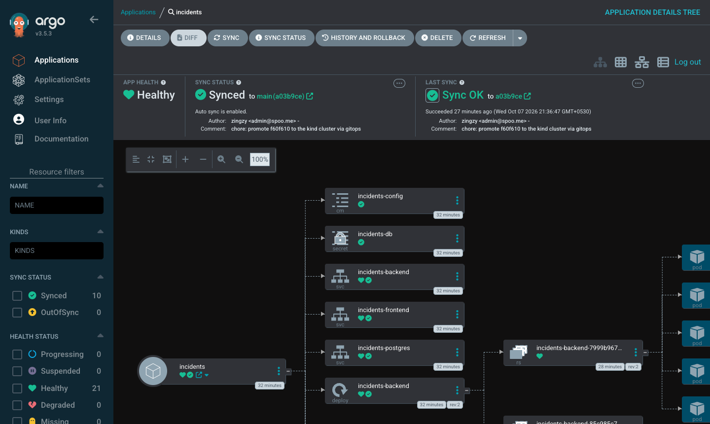

Self heal: I scaled the frontend to 1 by hand, and Argo CD put it back to 2.

```
$ kubectl -n incidents scale deploy incidents-frontend --replicas=1
deployment.apps/incidents-frontend scaled
...
incidents-frontend   1/2     2            1           5m16s
...
incidents-frontend   2/2     2            2           5m53s
```

## Failure drills

Seven faults introduced on purpose into the running app to practise debugging.
The break files live in `k8s/drills/`.

**1. Image tag that was never pushed** (`01-wrong-image-tag.values.yaml`).
Symptom: `helm upgrade` said `deployed`, one new pod sat in `ImagePullBackOff`,
`rollout status` timed out, and `/api` kept answering `HTTP 200` because the
rolling update never removes a ready pod. Key line:

```
Failed to pull image "ghcr.io/zingzy/incident-tracker-backend:1.0.0-does-not-exist": rpc error: code = NotFound desc = failed to pull and unpack image "ghcr.io/zingzy/incident-tracker-backend:1.0.0-does-not-exist": failed to resolve reference "ghcr.io/zingzy/incident-tracker-backend:1.0.0-does-not-exist": ghcr.io/zingzy/incident-tracker-backend:1.0.0-does-not-exist: not found
```

Root cause: no such tag. Fix: `helm rollback incidents 3 --wait`. Verify:
`successfully rolled out`, `HTTP 200`.

**2. Service selector mismatch** (`02-selector-mismatch.patch.yaml`). Symptom:
`HTTP 503` on `/api` while the UI still loaded. Key line:
`Service "incidents/incidents-backend" does not have any active Endpoint.`
Root cause: the Service selects `component=api`, the pods are
`component=backend`. Re-applying the chart failed:

```
Error: UPGRADE FAILED: conflict occurred while applying object incidents/incidents-backend /v1, Kind=Service: Apply failed with 1 conflict: conflict with "kubectl-patch" using v1: .spec.selector
```

Helm 4 uses server-side apply, and the `kubectl patch` now owned the field. Fix:
`helm upgrade --reuse-values --force-conflicts`. Verify: two endpoints, `HTTP 200`.

**3. Secret key that does not exist** (`03-bad-secret-key.patch.json`).
Symptom: `CreateContainerConfigError`, no container logs at all. Key line, only
in the events: `Error: couldn't find key DB_URL in Secret incidents/incidents-db`.
Root cause: the key is `DATABASE_URL`. Fix: `kubectl rollout undo
deploy/incidents-backend`. Verify: `successfully rolled out`, `HTTP 200`.

**4. Readiness probe on the wrong path** (`04-readiness-path.values.yaml`).
Symptom: new pod `Running` but `0/1`, rollout stuck, users unaffected. Key
lines: `Readiness probe failed: HTTP probe failed with statuscode: 404` and, in
the app log, `"GET /readyz HTTP/1.1" 404 Not Found`. The EndpointSlice listed
the pod with `ready=false`, so it never got traffic. Root cause: the app serves
`/ready`. Fix: `helm rollback incidents 7`. Verify: rollout finished.

**5. Memory limit that OOMKills** (`05-oom-limit.values.yaml`, 24Mi; a healthy
backend uses about 70Mi). Symptom: `CrashLoopBackOff`, `Reason: OOMKilled`,
`Exit Code: 137`. Key line from the node's kernel log:

```
[ 8619.861441] Memory cgroup out of memory: Killed process 96547 (alembic) total-vm:41580kB, anon-rss:23672kB, file-rss:10292kB, shmem-rss:0kB, UID:10001 pgtables:116kB oom_score_adj:994
```

Root cause: the limit is below what Python needs to run the migration. Fix:
`helm rollback incidents 9` to 96Mi request and 256Mi limit. Verify:
`{"limits":{"cpu":"500m","memory":"256Mi"},"requests":{"cpu":"50m","memory":"96Mi"}}`, `HTTP 200`.

**6. Ingress pointing at a port the Service does not have**
(`06-ingress-wrong-port.patch.json`). Symptom: `HTTP 503` on `/api`, `HTTP 200`
on `/`, and nothing useful in the backend logs because no request reached it.
Key line, from `kubectl describe ingress`:

```
                       /api   incidents-backend:web ()
```

The empty parentheses mean no endpoints. Root cause: the Service only has a
port named `http`. Fix: `helm upgrade --reuse-values --force-conflicts`.
Verify: `HTTP 200`.

**7. Database password drift** (`07-wrong-db-password.patch.yaml`). The Secret
was changed, but PostgreSQL still has the password it was initialised with.
Nothing broke until the pods restarted. Symptom after
`kubectl rollout restart`: the new pod in `CrashLoopBackOff`, the old pods
still serving. Key line:

```
[pod/incidents-backend-8b759d8cf-2hrpf/backend] sqlalchemy.exc.OperationalError: (psycopg.OperationalError) connection failed: connection to server at "10.96.109.169", port 5432 failed: FATAL:  password authentication failed for user "incidents"
```

Root cause: rotating a database password means changing it in the database and
in the Secret together. Fix: `helm upgrade --reuse-values --force-conflicts`
restored the Secret, and the crashing pod picked it up on its next restart.
Verify: `successfully rolled out`, `HTTP 200`.

## Screenshots

| File | What it shows |
|---|---|
| [01-app.png](docs/screenshots/01-app.png) | The app through the Ingress after the GitOps promotion |
| [02-tests-and-compose.png](docs/screenshots/02-tests-and-compose.png) | 15 tests passing, Compose running, non-root containers |
| [03-helm-and-kubectl.png](docs/screenshots/03-helm-and-kubectl.png) | `helm list`, pods, Services, Ingress, HPA, PVC, metrics |
| [04-terraform-apply-eks.png](docs/screenshots/04-terraform-apply-eks.png) | Terraform apply on AWS and a pod running on the EKS node |
| [05-terraform-destroy.png](docs/screenshots/05-terraform-destroy.png) | Terraform destroy and the clean-up checks |
| [06-ghcr-package.png](docs/screenshots/06-ghcr-package.png) | GHCR package tagged with commit SHAs |
| [07-ci-scan-gate-deploy.png](docs/screenshots/07-ci-scan-gate-deploy.png) | Tests, Trivy, the gate, push and deploy from the run logs |
| [08-grafana-dashboard.png](docs/screenshots/08-grafana-dashboard.png) | Grafana under load |
| [09-argocd-synced.png](docs/screenshots/09-argocd-synced.png) | Argo CD synced to the Git change |
| [10-docker-compose-up.png](docs/screenshots/10-docker-compose-up.png) | `docker compose up --build` from the repo root |
| [11-app-localhost-3000.png](docs/screenshots/11-app-localhost-3000.png) | The app in the browser at localhost:3000 |
| [12-pytest.png](docs/screenshots/12-pytest.png) | `pytest -v`, 15 passed |
| [13-metrics-curl.png](docs/screenshots/13-metrics-curl.png) | `curl /metrics` on the backend |
| [14-terraform-plan.png](docs/screenshots/14-terraform-plan.png) | `terraform init` and `terraform plan` |

## Lessons learned

- "Ready" is not "able to do the job". A Ready ingress-nginx pod can refuse its
  webhook, a Running backend can still be migrating. Wait for the exact thing
  you need.
- Some failures stay hidden until a restart. The password drift did nothing
  until new pods started, and a Secret change does not restart pods on its own.
- Helm 4's server-side apply turns a manual `kubectl patch` into a blocker for
  the next `helm upgrade` until someone passes `--force-conflicts`.
- Status lines are summaries. `helm upgrade` said `deployed` for a pod that
  could never pull, and a broken readiness probe left users unaffected while the
  rollout hung. Events, exit codes and logs were the ground truth.
- On AWS, deleting can be slower than creating, and clean-up needs direct
  checks per service, because the tag index lags and some resources never carry
  your tags.
- Keep the deploy target in Git. A promotion is one readable commit, and a
  manual change in the cluster does not last.
